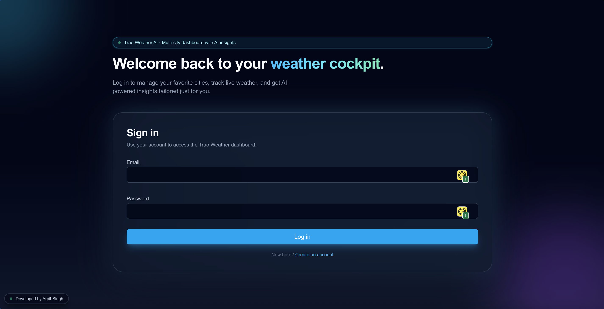
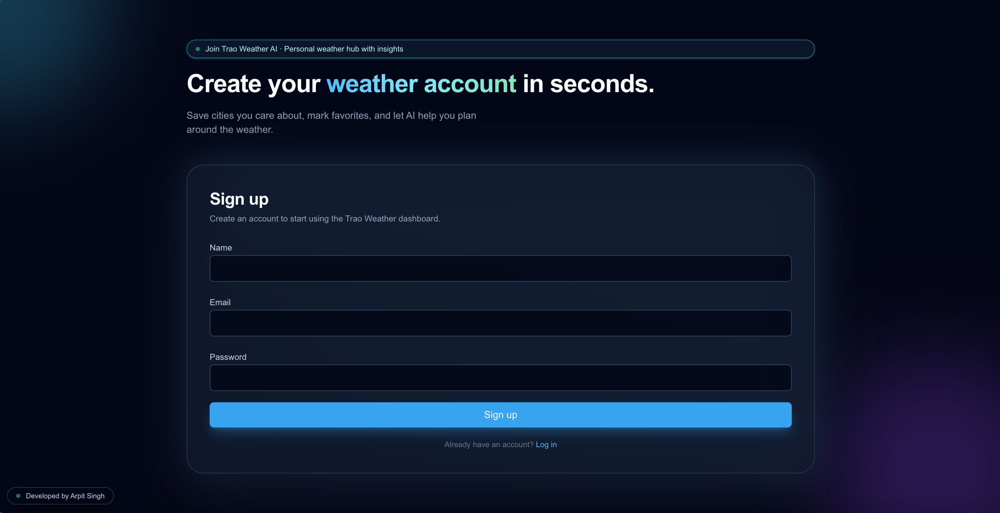
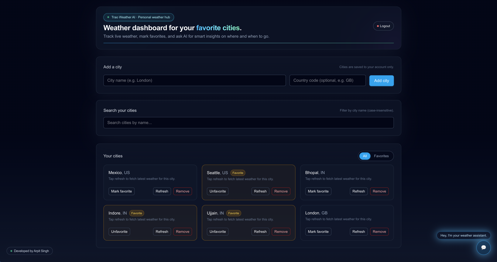
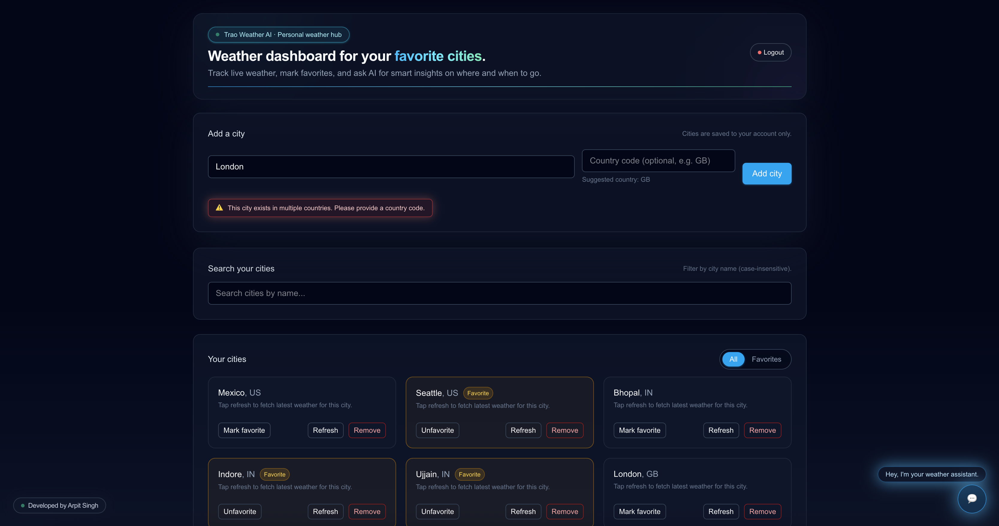
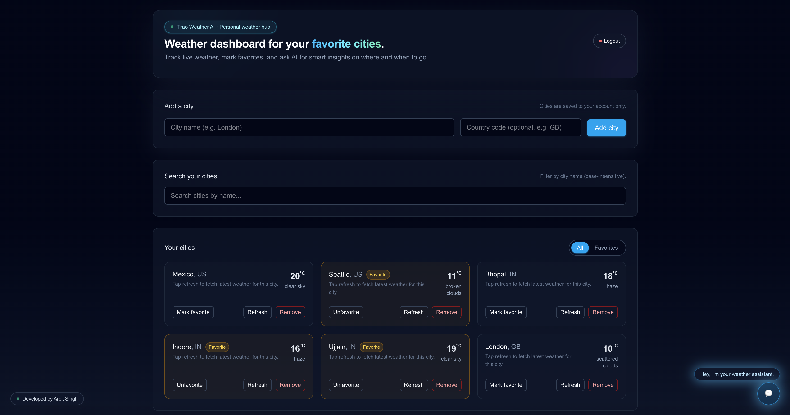
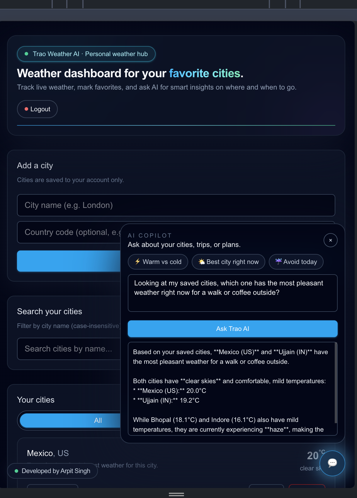

# Trao Weather AI

Multi‑user, multi‑city weather dashboard with AI‑powered insights.  
Live demo: **https://trao-weather-ai.vercel.app/**  
Backend API: **https://trao-weather-backend.onrender.com/**  
Repository: **https://github.com/TSM-ArpitSG/trao-weather-ai**

---

## Demo Video

A short walkthrough video of Trao Weather AI is available here:

**Video link:** _[Add Google Drive / Loom URL here]_

---

## Table of Contents

- [1. Project Overview](#1-project-overview)
- [2. Tech Stack](#2-tech-stack)
- [3. High-Level Architecture](#3-high-level-architecture)
- [4. Project Structure](#4-project-structure)
- [5. Backend Details (Node + Express)](#5-backend-details-node--express)
- [6. Frontend Details (Next.js + Tailwind)](#6-frontend-details-nextjs--tailwind)
- [7. Environment Configuration](#7-environment-configuration)
- [8. Local Development](#8-local-development)
- [9. Deployment](#9-deployment)
- [10. Screenshots](#10-screenshots-to-be-added)
- [11. How This Meets the Assessment Requirements](#11-how-this-meets-the-assessment-requirements)
- [12. Credits](#12-credits)

---

## 1. Project Overview

Trao Weather AI is a full‑stack application that lets each user:

- Register / log in securely.
- Save their own set of cities.
- Mark favorite cities.
- See live weather cards with temperature and description.
- Ask an AI assistant for smart insights over their saved cities.
- Use a fully responsive UI that adapts across mobile, tablet, and desktop.

It is built and structured like a production app, not a quick demo:

- Clear separation of frontend, backend, and database.
- Strong error handling and user feedback.
- Theming and UX designed for a consistent "cyber‑neon" experience.

---

## 2. Tech Stack

**Frontend**

- Next.js (App Router, client components)
- React
- TypeScript
- Tailwind CSS

**Backend**

- Node.js
- Express
- TypeScript
- Mongoose (MongoDB ODM)
- Axios (for OpenWeather calls)
- JWT (jsonwebtoken) for auth

**Database**

- MongoDB Atlas (hosted)

**External APIs**

- **Weather data:** OpenWeather API  
- **AI assistant:** Google Gemini (`gemini-3-flash-preview` via `generativelanguage.googleapis.com`)

---

## 3. High‑Level Architecture

```text
Frontend (Next.js, Vercel)
  |
  |  HTTPS JSON requests
  v
Backend API (Express, Render)
  |
  |  Mongoose models & services
  v
MongoDB Atlas (cloud)
```

- Frontend calls the backend via `NEXT_PUBLIC_API_BASE_URL`.
- Backend exposes REST endpoints for:
  - Auth (`/auth/register`, `/auth/login`)
  - Cities (`/cities`, `/cities/:id`, `/cities/:id/weather`, `/cities/:id/favorite`)
  - AI insights (`/ai/insights`)
- Backend stores users and cities in MongoDB Atlas, scoped by `userId`.

---

## 4. Project Structure

```text
trao-weather-app/
├── backend/               # Node/Express API (TypeScript)
│   ├── src/
│   │   ├── app.ts         # Express app wiring
│   │   ├── server.ts      # Server startup, health check
│   │   ├── config/
│   │   │   └── db.ts      # MongoDB connection (Atlas)
│   │   ├── controllers/   # HTTP layer (auth, cities, AI)
│   │   ├── services/      # Business logic (auth, geo, weather, AI)
│   │   ├── repositories/  # Data access via Mongoose
│   │   ├── models/        # Mongoose schemas (User, City)
│   │   └── middleware/
│   │       └── auth.middleware.ts  # JWT auth guard
│   ├── package.json
│   └── tsconfig.json
│
├── frontend/              # Next.js + Tailwind UI (TypeScript)
│   ├── src/app/
│   │   ├── (auth)/
│   │   │   ├── login/page.tsx      # Login screen
│   │   │   └── register/page.tsx   # Registration screen
│   │   ├── dashboard/page.tsx      # Main dashboard
│   │   ├── layout.tsx              # Root layout, theme shell
│   │   ├── page.tsx                # Redirect root → /dashboard
│   │   └── globals.css             # Global styles & theme
│   ├── src/lib/api.ts              # API helper (fetch wrapper)
│   ├── package.json
│   └── tsconfig.json
│
├── .gitignore              # Ignore node_modules, dist, .env, logs
└── Trao FS-Assesment.md    # Assignment specification
```

---

## 5. Backend Details (Node + Express)

### 5.1 Auth

- **Register**: `POST /auth/register`
  - Request: `{ name, email, password }`
  - Hashes password, stores user, returns JWT + user info.
- **Login**: `POST /auth/login`
  - Request: `{ email, password }`
  - Verifies credentials, returns JWT + user info.
- Passwords are hashed (no plain‑text storage).
- JWT is signed with `JWT_SECRET` and includes the user ID.

### 5.2 Cities

- **List cities**: `GET /cities`
  - Returns all cities for the authenticated user.
- **Add city**: `POST /cities`
  - Request: `{ name, country? }`
  - Uses geo service to resolve `(name, country)` to a canonical location.
  - Prevents duplicates with a compound index `(userId, name, country)`.
  - Returns the saved city document.
- **Delete city**: `DELETE /cities/:id`
- **Toggle favorite**: `PATCH /cities/:id/favorite`
  - Request: `{ isFavorite: boolean }`
- **Weather for city**: `GET /cities/:id/weather`
  - Calls OpenWeather using saved city coordinates / name.
  - Returns:
    - `temperature`
    - `description`
    - `icon` code
  - Handles OpenWeather errors and surfaces them as friendly messages.

### 5.3 AI Insights

- **Endpoint**: `POST /ai/insights`
  - Request: `{ question: string }`
  - Loads the current user’s cities and their latest weather data.
  - Calls Gemini model with a prompt including:
    - Cities + countries
    - Any cached weather data
    - User’s question
  - Safely falls back if Gemini fails (and marks `usedFallback`).

---

## 6. Frontend Details (Next.js + Tailwind)

### 6.1 Auth Pages

- **Login** (`/login`):
  - Hero intro: “Welcome back to your weather cockpit.”
  - Badge: “Trao Weather AI · Multi-city dashboard with AI insights.”
  - Form:
    - Email, password
    - Calls `/auth/login`
    - Stores JWT + user in `localStorage`
    - Redirects to `/dashboard`.

- **Register** (`/register`):
  - Form: Name, email, password, confirm password.
  - Shows validation and backend errors inline.
  - On success, logs in immediately and redirects to `/dashboard`.

### 6.2 Dashboard (`/dashboard`)

- **Auth guard (client‑side)**
  - On mount, reads `auth_token` from `localStorage`.
  - If missing, redirects to `/login`.
  - Uses `token` state for all API calls.

- **Header**
  - Pill: “Trao Weather AI · Personal weather hub” (soft refresh).
  - Headline: “Weather dashboard for your favorite cities.”
  - Logout button:
    - Clears local storage.
    - Confirms via modal before logging out.

- **Add a city**
  - Form with:
    - City name
    - Optional country code (with suggestions from `/cities/suggest`).
  - On submit:
    - Calls `POST /cities`.
    - On success: city appears at top of list, inputs clear.
    - On error: shows styled red banner with friendly text:
      - Duplicate case: “You already have this city saved in your dashboard.”
      - Not found / not supported: “We couldn't find live weather for this city. Try checking the spelling or country code.”
      - Other failures: Original server message.

- **Search and filters**
  - Search box filters cities by name (case‑insensitive).
  - Toggle: All vs Favorites (chips in a pill).

- **City cards**
  - Each city shows:
    - Name and country.
    - Favorite badge.
    - Instruction text: “Tap refresh to fetch latest weather for this city.”
    - Weather snippet (temp + description) after a refresh.
  - Actions:
    - **Mark favorite / Unfavorite** → `PATCH /cities/:id/favorite`
    - **Refresh** → `GET /cities/:id/weather`
      - Error banner per card if OpenWeather fails:
        - “We couldn't load weather for this city right now. It may not be supported or temporarily unavailable.”
    - **Remove** → opens confirmation modal, then `DELETE /cities/:id`.

- **AI chat widget (floating bottom right)**
  - Toggle button opens a small chat window.
  - Pre‑canned questions (chips) to quickly hit common scenarios:
    - “Warm vs cold”
    - “Best city right now”
    - “Avoid today”
  - Textarea + button to ask any question.
  - Shows:
    - “Thinking…” while calling `/ai/insights`.
    - Answer text with `usedFallback` handled.
    - Error text if AI call fails.
  - Closes with a subtle animation.

- **Footer badge**
  - Fixed badge: “Developed by Arpit Singh.”

---

## 7. Environment Configuration

### Backend `.env` (local only, not committed)

```env
MONGODB_URI=mongodb+srv://<user>:<password>@cluster0.a29tfwh.mongodb.net/trao_weather_app?appName=Cluster0
JWT_SECRET=super-secret-change-me
PORT=4000

OPENWEATHER_API_KEY=<your-openweather-key>
OPENWEATHER_API_BASE_URL=https://api.openweathermap.org/data/2.5

GEMINI_API_BASE_URL=https://generativelanguage.googleapis.com
GEMINI_API_KEY=<your-gemini-key>
GEMINI_MODEL=gemini-3-flash-preview
```

### Frontend `.env.local` (local only)

```env
NEXT_PUBLIC_API_BASE_URL=http://localhost:4000
```

On Vercel, this is configured as a Project Environment Variable:

```env
NEXT_PUBLIC_API_BASE_URL=https://trao-weather-backend.onrender.com
```

---

## 8. Local Development

### Backend

```bash
cd backend
npm install
npm run dev      # runs ts-node src/server.ts on port 4000
```

- Health check: `http://localhost:4000/health` → `{"status":"ok"}`

### Frontend

```bash
cd frontend
npm install
npm run dev      # Next.js dev server on port 3000
```

- App: `http://localhost:3000`
- Root `/` redirects to `/dashboard`.
- If unauthenticated, dashboard sends you back to `/login`.

---

## 9. Deployment

### Backend – Render

- Service: **https://trao-weather-backend.onrender.com/**
- Source: GitHub repo (`trao-weather-ai`), Root Directory `backend`.
- Build command: `npm install && npm run build`
- Start command: `npm start`
- Env vars set in Render dashboard:
  - `MONGODB_URI`
  - `JWT_SECRET`
  - `PORT=4000`
  - `OPENWEATHER_API_KEY`
  - `OPENWEATHER_API_BASE_URL`
  - `GEMINI_API_BASE_URL`
  - `GEMINI_API_KEY`
  - `GEMINI_MODEL`
- MongoDB Atlas Network Access:
  - IP allowlist includes `0.0.0.0/0` (for Render/Vercel connectivity).

### Frontend – Vercel

- Live URL: **https://trao-weather-ai.vercel.app/**
- Source: same GitHub repo, Root Directory `frontend`.
- Framework: Next.js (auto-detected).
- Env var:
  - `NEXT_PUBLIC_API_BASE_URL=https://trao-weather-backend.onrender.com`
- On push to `main`, Vercel auto‑builds and redeploys.

---

## 10. Screenshots (to be added)

Add screenshots under a `screenshots/` folder and reference them here.

1. **Login Page**

   
   > Shows the neon login screen with badge “Trao Weather AI · Multi-city dashboard with AI insights”.

2. **Register Page**

     
   > Registration flow with form validation.

3. **Dashboard – Cities and Favorites**

     
   > Main dashboard listing multiple cities and favorites.

4. **Dashboard – Add City Errors**

     
   > Add‑city section showing styled red banner for duplicate / invalid city.

5. **Dashboard – Weather Cards**

     
   > City cards with temperatures, conditions, and “Refresh / Favorite / Remove” actions.

6. **Dashboard – AI Assistant**

     
   > Floating AI chat widget open with a sample answer.

Update this section with actual file paths once screenshots are added.

---

## 11. How This Meets the Assessment Requirements

Referencing **`Trao FS-Assesment.md`**:

### Required stack

- **Frontend:** Next.js + Tailwind CSS → used in `frontend/`.
- **Backend:** Node.js + Express → used in `backend/`.
- **Database:** MongoDB → Atlas cluster, accessed via Mongoose.
- **Language:** TypeScript → both frontend and backend.
- **External API:** OpenWeather → integrated via `weather.service.ts` on backend.

### Multi‑user weather dashboard

- Each user has their own account (auth via JWT).
- Cities are stored with `userId`, so lists are per‑user.
- Users can:
  - Add cities (name + optional country).
  - Mark favorites.
  - Remove cities.
  - Refresh weather per city.

### System design & decision‑making

- **Layered backend**:
  - Controllers → Services → Repositories → Models.
  - Auth middleware isolates JWT logic.
- **Data model**:
  - `User` and `City` schemas with proper indexes.
  - Unique constraint `(userId, name, country)` prevents duplicates.
- **Error handling & UX**:
  - Backend throws specific errors (duplicate key, city not found).
  - Frontend converts them to user‑friendly messages with `prettyError`.
- **Scalability**:
  - Stateless backend suitable for horizontal scaling on Render.
  - Atlas cluster can scale independently.

### Creativity & polish

- **Theme:** Cyber‑neon dashboard with gradients, glows, and micro‑animations.
- **AI Assistant:** Uses Gemini to analyze the user’s saved cities and weather.
- **UX touches**:
  - City search & favorites filter.
  - Smart tooltips and helper text under inputs.
  - Confirmation modals for logout and city deletion.
  - “Developed by Arpit Singh” badge.

The result is a production‑style, multi‑user weather application that fully aligns with the assessment’s stack and design expectations while adding an AI layer and polished UX.

---

## 12. Credits

- **Developed by:** Arpit Singh  
- **GitHub:** [TSM-ArpitSG](https://github.com/TSM-ArpitSG)  
- **Project:** Trao Weather AI – Multi‑city weather dashboard with AI insights
